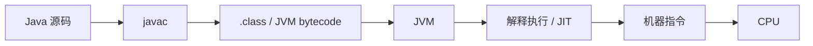
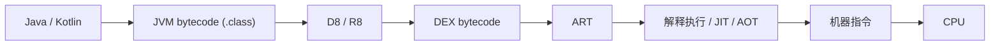
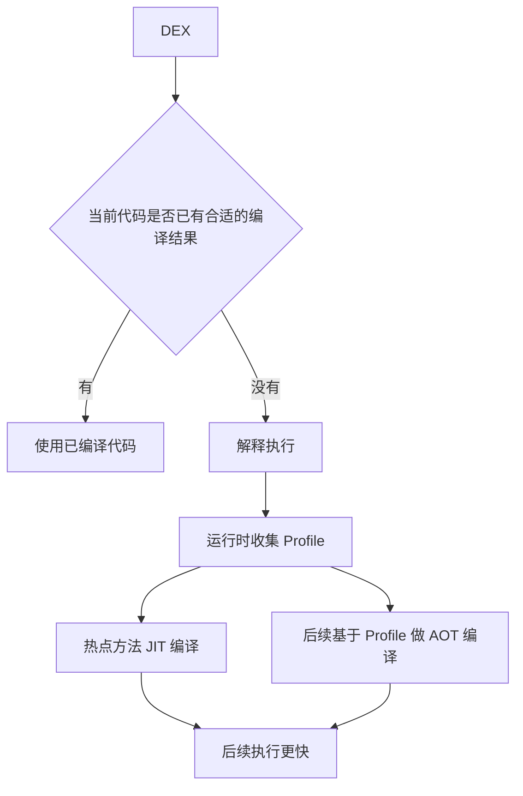

做了很多年 Android 之后，我发现一个很容易被忽略的问题：

我们每天都在写 Java 或 Kotlin，但一行代码从源码变成手机上真正执行的指令，中间到底经历了什么？

如果这条链路没有建立起来，JVM、JIT、D8、R8、DEX、ART 很容易变成一堆互相打架的名词。

这篇文章只做一件事：把它们放回正确的位置。

## 先看完整地图

对于 JVM 世界，可以先压缩成：



如果是面向 JVM 的 Kotlin，前半段可以理解成：

```text
Kotlin
↓
Kotlin 编译器
↓
.class
```

真正到了 Android，链路会多一层转换：



这张图是我现在理解 Android 运行机制时最重要的一张地图。

## javac 做的不是“把 Java 变成机器码”

例如：

```java
public int add(int a, int b) {
    return a + b;
}
```

`javac` 的主要任务不是直接生成 ARM 或 x86 指令，而是生成 JVM 能理解的 `.class` 文件。

`.class` 里面包含 JVM bytecode，以及类、字段、方法、常量池等结构信息。

所以：

```text
Java 源码 != JVM 字节码 != CPU 机器码
```

这是后面理解所有 JVM 与 Android 编译问题的基础。

## JVM 为什么还需要 JIT

JVM 拿到 bytecode 之后，可以解释执行。

可以把解释执行理解为：

> JVM 一边读取字节码，一边按照字节码语义完成工作。

但如果一段代码被反复执行，每次都重新解释显然不够理想。

JIT，也就是 Just-In-Time Compilation，会在程序运行过程中，根据实际执行情况把适合的热点代码编译成本地机器码。

所以 JVM 的运行过程不能简单理解成：

```text
.class → CPU
```

更准确的心智模型是：

```text
.class
↓
JVM Runtime
↓
解释器 / JIT 等执行机制
↓
机器码
↓
CPU
```

## Android 为什么不能直接把 .class 当最终运行格式

Android 使用的是 ART，也就是 Android Runtime。

ART 执行的核心应用字节码格式是 DEX，而不是普通 JVM 的 class 文件格式。

因此 Android 构建过程中还有一个关键阶段：

```text
.class
↓
DEX
```

Google 官方的 D8 文档将 D8 定义为把 Java bytecode 编译成 Android 设备运行的 DEX bytecode 的工具。

也就是说，Java/Kotlin 在进入 Android Runtime 之前，需要从 JVM bytecode 世界跨到 DEX bytecode 世界。

## D8 和 R8 分别站在哪里

最容易混淆的是 D8 和 R8。

我现在用下面这个方式区分：

### D8

D8 的核心职责可以先理解成：

> 把 Java bytecode 转成 DEX bytecode。

它是 Android 构建链里“进入 DEX 世界”的重要工具。

### R8

R8 更关注发布构建中的代码优化。

例如：

- 移除不可达代码
- 方法内联
- 类合并
- 名称缩短
- 配合资源缩减

最终发布流程里，R8 和 DEX 生成关系很紧密，但在建立基础心智模型时，可以先记：

```text
D8：重点理解 dexing
R8：重点理解 shrinking / optimization / obfuscation
```

不要把两者都粗暴理解成“混淆工具”。

## ART 并不是只靠 AOT

我以前很容易把 ART 记成：

> Dalvik 是 JIT，ART 是 AOT。

这个说法放到今天已经过于简单。

Android 官方文档明确说明，现代 ART 会组合使用：

- 解释执行
- JIT
- AOT
- Profile-guided compilation

从 Android 7 开始，ART 会结合 JIT、AOT 和解释执行。

因此更正确的理解是：



ART 不是在 JIT 和 AOT 之间二选一，而是在不同阶段组合使用这些机制。

## 为什么高级 Android 工程师需要理解这条链

这套知识并不是为了面试背名词。

它会直接影响很多 Android 工程问题的理解。

### 1. 为什么 R8 可能让 Release 出问题

因为 Release 构建不是简单“把 Debug 打个包”。

R8 可能重写、移除或重命名代码。

如果项目里有反射、JNI、序列化框架或者依赖运行时类名的逻辑，就必须理解 keep rule 为什么存在。

### 2. 为什么 Baseline Profile 能改善启动

因为 ART 的执行并不是永远从同一个状态开始。

Profile 可以帮助运行时更早知道哪些路径重要，从而让关键代码更早得到合适的编译结果。

### 3. 为什么看性能问题不能只看源码

源码只是第一层。

一个性能问题最终可能涉及：

```text
源码
→ 编译结果
→ DEX
→ Runtime
→ JIT/AOT
→ GC
→ CPU
```

高级 Android 工程师至少应该知道问题可能落在哪一层。

## 我现在最容易记住的一句话

Java/JVM 世界：

```text
Java → .class → JVM → machine code
```

Android 世界：

```text
Java/Kotlin → .class → DEX → ART → machine code
```

中间的 D8、R8、JIT、AOT，不再是孤立名词，而是这条流水线上的不同工位。

## 参考资料

- [Java Virtual Machine Specification](https://docs.oracle.com/javase/specs/)
- [Android Developers: d8](https://developer.android.com/tools/d8)
- [Android Open Source Project: Android runtime and Dalvik](https://source.android.com/docs/core/runtime)
- [Android Open Source Project: Configure ART](https://source.android.com/docs/core/runtime/configure)
- [Android Developers: Enable app optimization with R8](https://developer.android.com/topic/performance/app-optimization/enable-app-optimization)
