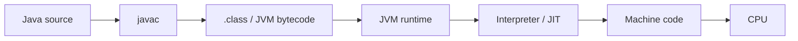
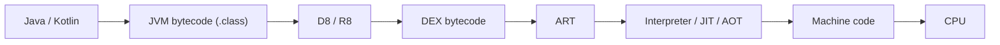
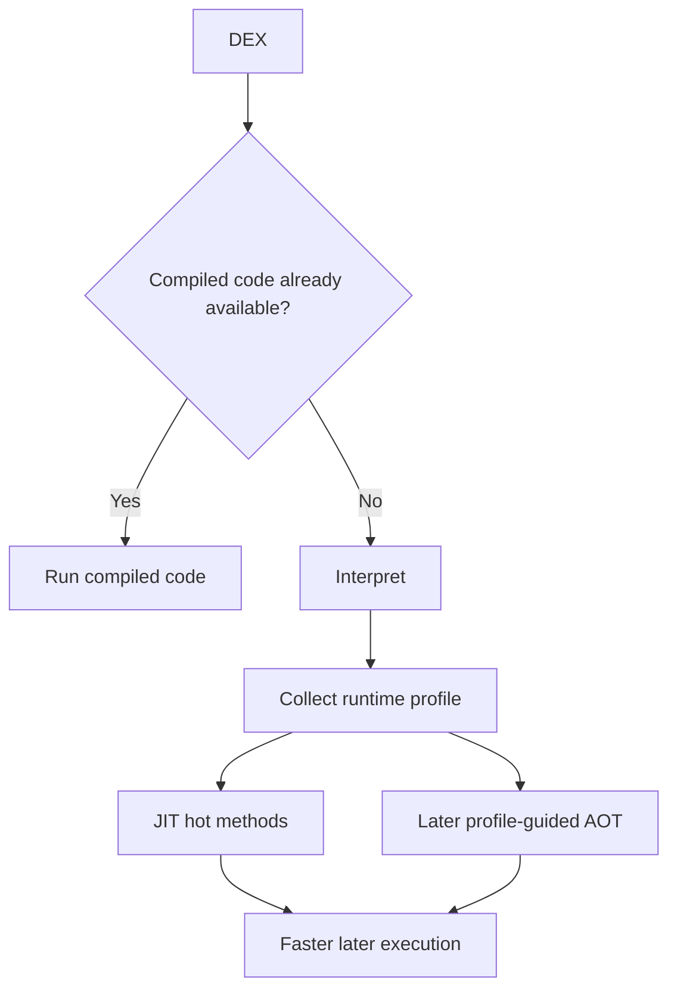

After years of Android development, I realized that I could use Java, Kotlin, Gradle, and Android Studio every day without having one clean mental model of how code actually reaches the CPU.

That gap makes terms such as JVM, D8, R8, DEX, JIT, AOT, and ART feel more complicated than they really are.

The useful starting point is a pipeline.

## The JVM-side pipeline

For ordinary Java code:



The important distinction is:

```text
Java source != JVM bytecode != CPU machine code
```

`javac` does not normally turn an application directly into ARM or x86 instructions. It produces the structured class-file format defined by the JVM specification.

Kotlin targeting the JVM follows the same broad idea: Kotlin source is compiled into JVM-compatible class files before the Android-specific part of the toolchain takes over.

## Android adds a different bytecode format

Android apps do not use ordinary JVM class files as their final runtime bytecode format.

ART executes DEX bytecode.

That gives us a more useful Android map:



Google's D8 documentation describes D8 as the tool that compiles Java bytecode into DEX bytecode for Android devices.

That one sentence clears up a lot of confusion: DEX is not just another file extension for a class file. It is a different bytecode format designed for the Android runtime.

## D8 and R8 are not the same thing

I keep the difference simple.

**D8** is mainly about dexing: turning JVM bytecode into DEX bytecode.

**R8** is the optimizer used for release builds. It can remove unreachable code, rewrite code, inline methods, merge classes, shorten names, and work with resource shrinking.

A useful shortcut is:

```text
D8 -> dexing
R8 -> shrinking + optimization + obfuscation
```

The real Android build pipeline has more detail, but this model is accurate enough to reason about most application-level problems.

## ART is not simply "AOT instead of JIT"

An old explanation says Dalvik means JIT and ART means AOT.

Modern ART is more interesting than that.

Android's runtime documentation describes a hybrid model that can use interpretation, JIT compilation, AOT compilation, and profile-guided compilation.



This matters because Android performance is partly about what the runtime knows about your important code paths and when it can compile them.

## Why this matters in real Android engineering

This pipeline explains several practical issues.

### Release-only R8 failures

A release build may remove, rename, or rewrite code. Reflection, JNI, serializers, and libraries that depend on runtime class names can therefore behave differently unless their rules are correct.

### Baseline Profiles

A profile gives ART useful information about important code paths earlier. That helps critical startup and interaction paths reach an optimized state sooner.

### Performance debugging

Source code is only the first layer. A slow path can involve compilation, DEX layout, runtime compilation, allocation, GC, or native execution.

A senior Android engineer does not need to implement ART, but should know which layer a problem belongs to.

## The compact mental model

For the JVM:

```text
source -> .class -> JVM -> machine code
```

For Android:

```text
source -> .class -> DEX -> ART -> machine code
```

Once this is clear, D8, R8, JIT, and AOT stop being disconnected interview terms. They become stages and mechanisms inside one execution pipeline.

## References

- [Java Virtual Machine Specification](https://docs.oracle.com/javase/specs/)
- [Android Developers: d8](https://developer.android.com/tools/d8)
- [AOSP: Android runtime and Dalvik](https://source.android.com/docs/core/runtime)
- [AOSP: Configure ART](https://source.android.com/docs/core/runtime/configure)
- [Android Developers: Enable app optimization with R8](https://developer.android.com/topic/performance/app-optimization/enable-app-optimization)
