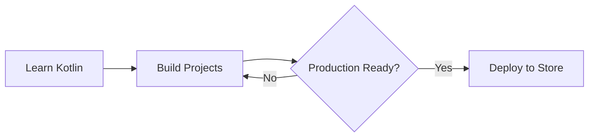

# Getting Started with Android Development

Android development is an exciting journey that starts with understanding the fundamentals. In this post, I'll share my experience and tips for getting started.

add a test line

## Why Android?

Android powers over 2.5 billion devices worldwide. As a developer, this means your apps can reach a massive audience across smartphones, tablets, TVs, and even cars.

## Getting Started

1. **Set up your environment** - Android Studio is the official IDE
2. **Learn Kotlin** - It's the preferred language for Android
3. **Understand the architecture** - MVVM, Clean Architecture
4. **Build projects** - Practice makes perfect

## Mermaid Flowchart Example

## Key Takeaways

- Start with simple projects
- Focus on fundamentals
- Read official documentation
- Join the community
