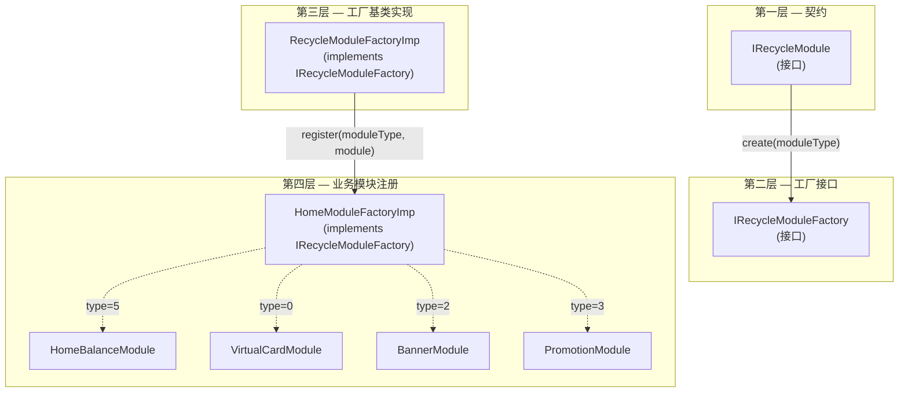

## 背景

消费类 App 的首页需求变化极快——运营 Banner、余额卡片、交易历史、快捷入口，每隔一个 sprint 就可能新增一种卡片类型。在多模块架构（`mod_main`、`mod_transfer`、`mod_aml` 等）下，如果把卡片逻辑直接堆在 `HomeFragment` 里，很快会失控：

- Layout 文件充斥着 `include` 标签
- Fragment 代码行数膨胀到几百行
- 新增一种卡片就要修改核心模块，破坏模块边界

项目通过 **HomeModuleFactory** 解决这一问题：一套基于工厂模式的架构，让各业务模块自主注册 UI 卡片，`HomeFragment` 本身无需感知任何具体卡片类型。

## 四层接口架构



### 第一层：IRecycleModule（契约）

所有模块实现此接口：

```kotlin
interface IRecycleModule {
    fun getModuleType(): Int      // 唯一类型标识
    fun getModuleResId(): Int     // 布局资源 ID
    fun getItemViewType(): Int    // RecyclerView.ViewHolder 类型
    fun createViewHolder(parent: ViewGroup, view: View): RecyclerView.ViewHolder
    fun bindView(holder: RecyclerView.ViewHolder, position: Int, payloads: MutableList<Any>)
    fun onViewAttachedToWindow(holder: RecyclerView.ViewHolder)
    fun onViewDetachedFromWindow(holder: RecyclerView.ViewHolder)
}
```

接口定义了模块的「长什么样」和「如何绑定」，不关心谁创建它、放在哪里。

### 第二层：IRecycleModuleFactory（工厂接口）

```kotlin
interface IRecycleModuleFactory {
    fun createModule(moduleType: Int): IRecycleModule?
    fun registerModule(moduleType: Int, module: IRecycleModule)
}
```

两个职责：**按类型创建**模块，**运行时注册**新模块类型。这里是架构弹性的来源——新卡片可以从任意模块注册，不限于首页模块。

### 第三层：RecycleModuleFactoryImp（基类实现）

```kotlin
class RecycleModuleFactoryImp : IRecycleModuleFactory {
    private val modules = SparseArray<IRecycleModule>()

    override fun createModule(moduleType: Int): IRecycleModule? {
        return modules.get(moduleType)
    }

    override fun registerModule(moduleType: Int, module: IRecycleModule) {
        modules.put(moduleType, module)
    }
}
```

`SparseArray<Int, IRecycleModule>` 提供 O(1) 查找性能，没有 `HashMap<Integer, ...>` 的装箱开销。

### 第四层：HomeModuleFactoryImp（业务注册）

```kotlin
class HomeModuleFactoryImp : RecycleModuleFactoryImp() {
    init {
        registerModule(0, VirtualCardModule())
        registerModule(5, HomeBalanceModule())
        registerModule(2, BannerModule())
        registerModule(3, PromotionModule())
        registerModule(6, TransactionHistoryModule())
        registerModule(7, MapModule())
    }
}
```

每个 Module 是持有类型 ID 和布局的数据类。`HomeFragment` 只持有 `HomeModuleFactoryImp` 的引用，从不引入任何具体模块类。

## HomeFragment 的使用方式

```kotlin
class HomeFragment : Fragment() {
    private lateinit var factory: HomeModuleFactoryImp
    private lateinit var adapter: CommonRecycleModuleAdapter

    override fun onViewCreated(view: View, savedInstanceState: Bundle?) {
        factory = HomeModuleFactoryImp()
        adapter = CommonRecycleModuleAdapter(factory)
        recyclerView.adapter = adapter
    }
}
```

`CommonRecycleModuleAdapter` 按 position 查询工厂获取对应 `IRecycleModule`，然后将绑定工作委托给它。`HomeFragment` 不存在任何类型 switch 或具体卡片逻辑。

## 模块示例：HomeBalanceModule

```kotlin
class HomeBalanceModule : IRecycleModule {
    override fun getModuleType() = 5
    override fun getModuleResId() = R.layout.module_home_balance

    override fun createViewHolder(parent: ViewGroup, view: View): RecyclerView.ViewHolder {
        return BalanceViewHolder(view)
    }

    override fun bindView(holder: RecyclerView.ViewHolder, position: Int, payloads: MutableList<Any>) {
        // 加载余额数据、渲染7日趋势图、处理点击跳转账明细
        (holder as BalanceViewHolder).bind(balance, trendData)
    }
}
```

每个模块管理自己的数据加载（通常通过自己的 ViewModel）、布局展开和视图更新。

## 设计优势

| 优势 | 说明 |
|---|---|
| **模块边界保持清晰** | 各业务团队新增卡片无需修改 `mod_main` 或 `HomeFragment` |
| **单一 RecyclerView 多类型** | 一个 adapter 通过 `getItemViewType()` 委托处理所有卡片变体 |
| **O(1) 查找** | `SparseArray` 按类型常量时间获取模块 |
| **运行时注册** | 模块在类初始化时自我注册，无需维护中心注册文件 |
| **可测试性** | 每个模块可通过 mock `IRecycleModuleFactory` 独立单元测试 |

## 设计折衷

| 问题 | 严重程度 | 说明 |
|---|---|---|
| **无编译期安全** | 中 | 模块类型 ID 冲突时静默覆盖前面的注册，运行时才暴露 |
| **工厂知晓所有模块类型** | 低 | `HomeModuleFactoryImp`持有所有具体模块引用，若新模块类型需要特殊初始化逻辑，违反开闭原则 |
| **Adapter 复杂度随类型增长** | 低 | `CommonRecycleModuleAdapter` 需处理所有已注册模块的创建和绑定，卡片类型增多后需要纪律保持代码组织 |
| **模块间通信困难** | 中 | 模块间不能直接通信（如 Banner 点击无法直接刷新 Balance），需借助事件总线或父级 Coordinator |
| **类型 ID 冲突风险** | 中 | 无中心 ID 注册表，两位开发人员可能独立选用相同的 `moduleType` 值 |

## 总结

HomeModuleFactory 为原本混乱的首页 UI 带来了纪律性。通过将**契约（IRecycleModule）**、**工厂接口（IRecycleModuleFactory）**、**基类实现（RecycleModuleFactoryImp）**和**业务注册（HomeModuleFactoryImp）**四层分离，每层聚焦单一职责。

最实际的改进方向是引入共享的 `ModuleType` 枚举并加入编译期唯一性校验——在类型冲突达到运行前就暴露问题。在此基础上，该架构足以支撑首页卡片的高速扩张。