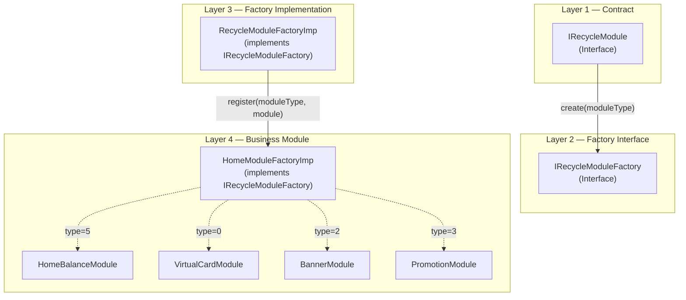

## Background

Homepage UIs in consumer apps tend to evolve rapidly — new promotion banners, balance widgets, transaction histories, navigation tiles, and more get added every sprint. In a modularized Android project where each business module (`mod_main`, `mod_transfer`, `mod_aml`, etc.) owns its own screens, embedding home UI logic directly into `HomeFragment` quickly becomes unmaintainable:

- Layout files bloat with `include` tags
- Fragment code grows to hundreds of lines handling dozens of card types
- Adding a new card requires modifying the core module — breaking the module boundary

The project solved this with **HomeModuleFactory**: a factory-pattern-based architecture that lets individual business modules register their own UI cards into a shared `RecyclerView` without HomeFragment knowing anything about them.

## 4-Layer Interface Architecture



### Layer 1: IRecycleModule (Contract)

Every module implements this interface:

```kotlin
interface IRecycleModule {
    fun getModuleType(): Int      // Unique type ID
    fun getModuleResId(): Int     // Layout resource ID
    fun getItemViewType(): Int    // RecyclerView.ViewHolder type
    fun createViewHolder(parent: ViewGroup, view: View): RecyclerView.ViewHolder
    fun bindView(holder: RecyclerView.ViewHolder, position: Int, payloads: MutableList<Any>)
    fun onViewAttachedToWindow(holder: RecyclerView.ViewHolder)
    fun onViewDetachedFromWindow(holder: RecyclerView.ViewHolder)
}
```

This interface defines **what** a module looks like and **how** it is bound — not who creates it or where it lives.

### Layer 2: IRecycleModuleFactory (Factory Interface)

```kotlin
interface IRecycleModuleFactory {
    fun createModule(moduleType: Int): IRecycleModule?
    fun registerModule(moduleType: Int, module: IRecycleModule)
}
```

The factory interface has two jobs: **create** a module by type, and **register** a new module type at runtime. This is where the architecture gains its flexibility — new cards can be registered from any module, not just the home module.

### Layer 3: RecycleModuleFactoryImp (Base Implementation)

```kotlin
class RecycleModuleFactoryImp : IRecycleModuleFactory {
    private val modules = SparseArray<IRecycleModule>()

    override fun createModule(moduleType: Int): IRecycleModule? {
        return modules.get(moduleType)
    }

    override fun registerModule(moduleType: Int, module: IRecycleModule) {
        modules.put(moduleType, module)
    }
}
```

`SparseArray` maps `Int → IRecycleModule`, providing O(1) lookup without the boxing overhead of `HashMap<Integer, ...>`.

### Layer 4: HomeModuleFactoryImp (Business Registration)

```kotlin
class HomeModuleFactoryImp : RecycleModuleFactoryImp() {
    init {
        registerModule(0, VirtualCardModule())
        registerModule(5, HomeBalanceModule())
        registerModule(2, BannerModule())
        registerModule(3, PromotionModule())
        registerModule(6, TransactionHistoryModule())
        registerModule(7, MapModule())
    }
}
```

Each module is a simple data class holding its type ID and layout. `HomeFragment` only holds a reference to `HomeModuleFactoryImp` — it never imports any concrete module class.

## How HomeFragment Uses It

```kotlin
class HomeFragment : Fragment() {
    private lateinit var factory: HomeModuleFactoryImp
    private lateinit var adapter: CommonRecycleModuleAdapter

    override fun onViewCreated(view: View, savedInstanceState: Bundle?) {
        factory = HomeModuleFactoryImp()
        adapter = CommonRecycleModuleAdapter(factory)
        recyclerView.adapter = adapter
    }
}
```

`CommonRecycleModuleAdapter` queries the factory by position to get the right `IRecycleModule`, then delegates binding to it. HomeFragment doesn't switch on module types or import any card logic.

## Module Example: HomeBalanceModule

```kotlin
class HomeBalanceModule : IRecycleModule {
    override fun getModuleType() = 5
    override fun getModuleResId() = R.layout.module_home_balance

    override fun createViewHolder(parent: ViewGroup, view: View): RecyclerView.ViewHolder {
        return BalanceViewHolder(view)
    }

    override fun bindView(holder: RecyclerView.ViewHolder, position: Int, payloads: MutableList<Any>) {
        // Load balance data, render 7-day trend chart, handle click to open balance detail
        (holder as BalanceViewHolder).bind(balance, trendData)
    }
}
```

Each module manages its own data loading (typically via its own `ViewModel`), layout inflation, and view updates.

## Design Benefits

| Benefit | Explanation |
|---|---|
| **Module boundary preserved** | New cards added by feature teams don't require changes to `mod_main` or `HomeFragment` |
| **Single RecyclerView, multiple types** | One adapter handles all card variants via `getItemViewType()` delegation |
| **O(1) lookup** | `SparseArray` gives constant-time module retrieval by type |
| **Runtime registration** | Modules register themselves at class initialization — no central registry file to maintain |
| **Testability** | Each module can be unit tested in isolation with a mock `IRecycleModuleFactory` |

## Design Tradeoffs

| Tradeoff | Severity | Detail |
|---|---|---|
| **No compile-time safety** | Medium | If a module type ID collides, it silently overwrites the earlier registration. No build error. |
| **Factory knows all module types** | Low | `HomeModuleFactoryImp` holds references to all concrete modules — violates open/closed principle if a new module type requires special initialization logic |
| **Adapter complexity grows** | Low | `CommonRecycleModuleAdapter` must handle `ViewHolder` creation and binding for all registered modules. As card types grow, this class requires discipline to stay organized |
| **Module communication** | Medium | Modules cannot directly communicate with each other (e.g., Banner → refresh Balance). Inter-module communication requires a shared event bus or a parent coordinator |
| **Type ID collision risk** | Medium | No centralized ID registry — two developers could pick the same `moduleType` value independently |

## Conclusion

HomeModuleFactory brings discipline to an otherwise chaotic homepage UI. By separating the **contract** (`IRecycleModule`), the **factory** (`IRecycleModuleFactory`), the **base implementation** (`RecycleModuleFactoryImp`), and the **business registration** (`HomeModuleFactoryImp`), the architecture keeps each layer focused on a single responsibility.

The most practical improvement would be a shared `ModuleType` enum with compile-time uniqueness checks — preventing ID collisions before they reach runtime. Beyond that, the pattern holds up well as the homepage grows more complex.