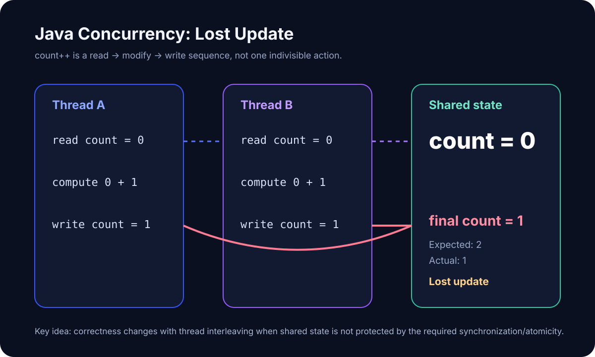

# Java 并发基础：为什么多个线程会把共享数据改乱？

> [!abstract] 这篇只解决一个核心问题
>
> **为什么两个线程同时操作同一份共享数据，结果会变错？**
>
> 这一篇先建立并发正确性的地基。暂时不深入 synchronized、volatile、CAS、Lock、线程池内部实现。

上一篇已经学过 JMM、可见性、原子性和 happens-before。现在把这些词真正放进一个会出 Bug 的程序里。

---

# 0. 先给最终答案

先把整篇压成这一条：

~~~text
多个线程
   ↓
访问同一份共享状态
   ↓
至少一个线程会写
   ↓
多个操作发生交错
   ↓
程序结果依赖执行时机
   ↓
Race Condition
   ↓
需要正确的同步 / 原子性设计
~~~

最重要的一句话：

> **并发问题的核心不是“线程很多”，而是多个执行流同时碰同一份可变共享状态。**

---

# 1. 学习前自检

先不要查答案。

### 问题 1

~~~java
int count = 0;
count++;
~~~

如果两个线程各执行一次，最终结果一定是 2 吗？

### 问题 2

如果我给 count 加上 volatile：

~~~java
volatile int count = 0;
~~~

两个线程同时执行 count++，最终一定正确吗？

### 问题 3

如果代码在你电脑上连续运行 100 次都正确，能证明它没有并发 Bug 吗？

这三个问题如果有一个不确定，这篇就值得认真看。

---

# 2. 先把新知识映射到你已经学过的东西

| 新知识 | 你已经学过的旧知识 | 连接点 | 最容易误解的地方 |
|---|---|---|---|
| Shared State，共享状态 | Heap 中的实例字段、static 字段、数组元素 | 多个线程可以访问同一份数据 | 不是所有变量都共享 |
| Race Condition，竞态条件 | 多线程执行顺序不固定 | 结果依赖线程交错顺序 | 不等于“程序一定崩溃” |
| Data Race，数据竞争 | JMM、happens-before | 冲突访问没有被 happens-before 排序 | 与 Race Condition 不是完全同义 |
| Atomicity，原子性 | JMM 三个基础属性之一 | 一个逻辑动作是否会被其他线程插进来 | 一行 Java 代码不等于一个原子动作 |
| Critical Section，临界区 | 多线程共享可变状态 | 必须作为整体保护的一段操作 | 不是“所有代码都上锁” |

> 检查题：为什么局部变量通常比共享字段更不容易出现这种并发问题？

---

# 3. 一句话直觉

> **两个线程都以为自己拿到的是“当前值”，但它们拿到的可能是同一个旧值。**

这就是很多丢失更新 Bug 的起点。

---

# 4. 先看一个 Android 业务画面

假设钱包页面需要并行刷新多个 RPC 数据源，我们记录成功返回的任务数：

~~~java
class SyncState {
    int successCount = 0;

    void onRequestSuccess() {
        successCount++;
    }
}
~~~

现在两个后台任务几乎同时成功：

~~~text
RPC Task A
    ↓
onRequestSuccess()

RPC Task B
    ↓
onRequestSuccess()
~~~

人的直觉：

~~~text
0
↓ A +1
1
↓ B +1
2
~~~

但真实并发执行并不保证两个操作排成这么整齐的一列。

> 检查题：这里真正危险的是“用了后台线程”，还是“两个后台任务共同修改 successCount”？

---

# 5. 最小 Java 例子

先脱离 Android，只看最小模型：

~~~java
class Counter {
    int count = 0;

    void increment() {
        count++;
    }
}
~~~

Thread A：

~~~java
counter.increment();
~~~

Thread B：

~~~java
counter.increment();
~~~

如果一开始：

~~~text
count = 0
~~~

我们希望：

~~~text
最终 count = 2
~~~

但可能得到：

~~~text
最终 count = 1
~~~

这种现象叫：

> **Lost Update，丢失更新**

---

# 6. 为什么一行 count++ 也会出问题？

不要把：

~~~java
count++;
~~~

想成一个不可切开的动作。

当前阶段只需要把它理解成三个逻辑步骤：

~~~text
1. 读取 count
2. 计算 count + 1
3. 把结果写回 count
~~~

注意：

> 这里是在建立并发心智模型，不是在声称 CPU 必然只执行这三条具体机器指令。

问题就出在这三个步骤之间，另一个线程可以插进来。

---

# 7. 两个线程是怎么把 2 算成 1 的？

一种可能的交错顺序：

| 时刻 | Thread A | Thread B | 共享 count |
|---|---|---|---:|
| 1 | 读取 0 |  | 0 |
| 2 |  | 读取 0 | 0 |
| 3 | 计算 1 |  | 0 |
| 4 |  | 计算 1 | 0 |
| 5 | 写入 1 |  | 1 |
| 6 |  | 写入 1 | 1 |

两个线程都没有“算错”。

A 算的是：

~~~text
0 + 1 = 1
~~~

B 算的也是：

~~~text
0 + 1 = 1
~~~

真正的问题是：

> **B 读取数据时，A 的整套“读取→修改→写回”还没有作为一个不可分割整体完成。**

所以 A 的一次更新被 B 覆盖掉了。

> 检查题：如果 Thread B 必须等 Thread A 完整执行完 increment() 才能进入，这个例子还会丢失更新吗？

---

# 8. Race Condition 到底是什么？

先用人话：

> **程序结果依赖多个线程“谁先谁后”的执行时机，而代码又没有把这种顺序或原子性正确控制住。**

这类问题就属于 Race Condition，竞态条件。

最危险的地方在于：

~~~text
它可能今天不出现
它可能 Debug 时不出现
它可能测试 100 次都不出现
它可能只在压力、慢设备或特殊时序下出现
~~~

所以：

> **“我本地跑起来没问题”不能证明并发代码正确。**

---

# 9. Race Condition 和 Data Race 不完全是同一个词

这是 Senior 面试容易被追问的边界。

## Race Condition

更广义的工程概念：

> 程序正确性依赖执行时序或操作交错。

## Data Race

JMM 中有更具体的定义。

如果两个不同线程对同一个变量发生冲突访问：

~~~text
read / write
或
write / write
~~~

并且：

~~~text
至少一个是 write
+
它们没有被 happens-before 关系排序
~~~

就构成 data race。

可以先记：

~~~text
Data Race
= JMM 对“未正确同步的冲突内存访问”的精确定义

Race Condition
= 更广义的“结果被并发时序影响”的工程问题
~~~

我们这个未同步的 count++ 例子，两者都涉及。

但不要粗暴记成：

~~~text
Race Condition == Data Race
~~~

> 检查题：为什么“没有 data race”仍然不代表所有并发业务逻辑一定正确？

提示：多个分别安全的操作，组合起来仍然可能缺少“整体原子性”。

---

# 10. 这和上一篇 JMM 是怎么连起来的？

上一篇学过：

~~~text
Visibility
Ordering
Atomicity
happens-before
~~~

现在它们不再是四个孤立术语。

count++ 的问题首先暴露的是：

> **复合操作缺少整体原子性。**

而当多个线程进行共享读写时，我们还必须问：

~~~text
写入对其他线程是否可见？
不同操作的观察顺序是什么？
冲突访问之间有没有 happens-before？
一组操作是否必须作为整体完成？
~~~

所以 JMM 的价值不是让你背规则。

它是在回答：

> **“我凭什么相信另一个线程看到的是正确的数据？”**

---

# 11. 什么是 Critical Section，临界区？

假设：

~~~java
void increment() {
    count++;
}
~~~

业务上真正要求的是：

~~~text
read count
+
add 1
+
write count
~~~

这一整组动作不能被另一个线程以会破坏正确性的方式插入。

这种必须被作为一个整体保护的代码区域，可以先理解成：

> **Critical Section，临界区**

后面学习 synchronized、Lock、Atomic 时，你真正要问的不是：

> “这个 API 怎么写？”

而是：

> **“我到底在保护哪一份共享状态，哪一组操作必须保持什么语义？”**

这个问题比记 API 更重要。

---

# 12. 后面几个工具分别会解决什么？

这一篇先只看路牌，不展开实现。

~~~text
synchronized
→ 互斥 + happens-before

volatile
→ 主要解决可见性 / 顺序语义
→ 不能把 count++ 自动变成原子复合操作

AtomicInteger / CAS
→ 支持特定原子读改写操作

Lock
→ 更显式、更灵活的锁控制

Thread Pool / Executor
→ 管理任务和线程资源
→ 本身不自动消灭共享状态竞态
~~~

最重要的边界：

> **“换成线程池”不等于“线程安全”。**

---

# 13. 三个现在就要拆掉的错误模型

## 错误模型 1：一行代码就是原子操作

~~~java
count++;
~~~

不是。

“源码只有一行”与“其他线程无法观察或插入中间状态”没有直接等号。

## 错误模型 2：加 volatile 就能解决 count++

~~~java
volatile int count;
count++;
~~~

volatile 可以提供重要的可见性和顺序语义，但它不会自动把 read-modify-write 组合成一个不可分割整体。

## 错误模型 3：加 sleep 让线程错开就好了

~~~java
Thread.sleep(10);
~~~

sleep 不是正确同步机制。

JLS 明确说明 Thread.sleep 和 Thread.yield 本身没有同步语义。

---

# 14. 最小练习，先不要看完整答案

目标：亲手制造一次丢失更新。

~~~yaml
exercise:
  objective: "让两个线程共同执行未同步的 count++，观察 expected 与 actual 的差异"
  context: "普通 Java Counter，不依赖 Android"
  expected_output: "expected = 200000，actual 可能小于 expected"
  constraints:
    - "两个线程共享同一个 Counter 实例"
    - "每个线程循环 100000 次"
    - "主线程必须等待两个线程结束后再读取结果"
    - "第一版禁止 synchronized、Lock、AtomicInteger"
  edge_cases:
    - "降低循环次数后 Bug 可能不出现"
    - "单次运行结果正确也不能证明线程安全"
  acceptance_criteria:
    - "能解释为什么 actual 可能小于 expected"
    - "能指出真正被共享的是哪个变量"
    - "能解释为什么 join 只负责等待结束，不负责让 count++ 变原子"
~~~

Starter Code：

~~~java
class Counter {
    int count = 0;

    void increment() {
        // TODO
    }
}

public class RaceDemo {
    public static void main(String[] args) throws Exception {
        Counter counter = new Counter();

        // TODO: Thread A
        // TODO: Thread B
        // TODO: start
        // TODO: join

        System.out.println(counter.count);
    }
}
~~~

不要先加锁。

第一步就是先把 Bug 跑出来。

---

# 15. 隐蔽 Bug 训练

先只判断有没有问题，不看答案。

## Bug 1

~~~java
class DownloadStats {
    volatile int finished = 0;

    void onFinished() {
        finished++;
    }
}
~~~

问题：

> finished 已经是 volatile，多个下载线程同时更新还安全吗？

## Bug 2

~~~java
if (!cache.containsKey(key)) {
    cache.put(key, load(key));
}
~~~

假设 containsKey 和 put 各自都是线程安全方法。

问题：

> 这整个 if + put 业务动作一定线程安全吗？

## Bug 3

~~~java
Thread.sleep(100);

if (ready) {
    use(data);
}
~~~

另一个线程会设置 data 和 ready。

问题：

> sleep 100ms 能不能作为“等另一个线程写完”的正确同步设计？

这三题后续都可以继续拆成子原子笔记。

---

# 16. Android 工程里怎么识别危险代码？

看到下面结构就应该亮黄灯：

~~~text
多个 Callback / Thread / Executor / Dispatcher
                 ↓
          同一个 mutable object
                 ↓
              有 write
~~~

尤其留意：

~~~java
retryCount++;
list.add(item);
map[key] = value;
state = newState;
if (!loaded) { load(); }
balance = balance + delta;
~~~

真正的问题不是这些 API 本身危险。

而是你必须继续问：

~~~text
谁在读？
谁在写？
可能有几个执行线程？
操作是不是复合动作？
需要什么 happens-before？
需要互斥，还是只需要可见性？
能不能改成不共享可变状态？
~~~

这才是 Senior Android 并发排查的起点。

---

# 17. Senior Android 面试表达

如果问：

> 什么是 Race Condition？为什么 count++ 在线程间不安全？

## L1

> 多线程同时操作一个变量会有线程安全问题。

太浅。

## L2

推荐：

> Race Condition 是程序正确性依赖线程执行时序的一类并发问题。count++ 虽然源码只有一行，但它是一个 read-modify-write 复合操作。两个线程可能都读取同一个旧值，各自加一后再写回，从而发生 lost update，所以最终结果可能小于预期。

## L3

继续补上边界：

> 从 JMM 角度，还要区分 race condition 和 data race。data race 指不同线程对同一变量存在未被 happens-before 排序的冲突访问，而且至少一个是写。正确同步可以消除 data race，但业务层的一组操作如果需要整体原子性，仍然可能存在更高层的竞态。因此我不会看到并发问题就机械加 synchronized，而是先识别共享状态、冲突访问、需要保护的不变量，再决定用锁、volatile、原子类、并发容器，或者直接减少共享可变状态。

### L3 追问

~~~text
为什么 volatile int count 仍然不能安全 count++？
data race 和 race condition 有什么区别？
两个线程都只读，会构成 data race 吗？
ConcurrentHashMap 的两个安全方法组合起来一定安全吗？
Thread.sleep 为什么不能替代同步？
线程池能保证线程安全吗？
如何在 Android 中定位低概率竞态？
~~~

---

# 18. 30 秒英文面试快答

> A race condition happens when program correctness depends on the timing or interleaving of concurrent operations. A typical example is count++. It looks like one statement, but logically it is a read-modify-write sequence. Two threads can read the same old value and overwrite each other's update. I first identify the shared mutable state and the required atomicity or happens-before relationship, then choose the synchronization mechanism instead of adding locks blindly.

高频词汇：

| English | 中文 |
|---|---|
| shared state | 共享状态 |
| mutable state | 可变状态 |
| race condition | 竞态条件 |
| data race | 数据竞争 |
| lost update | 丢失更新 |
| atomicity | 原子性 |
| interleaving | 操作交错 |
| conflicting access | 冲突访问 |
| critical section | 临界区 |
| synchronization | 同步 |

---

# 19. 第一轮闭卷题

- [ ] 并发问题为什么不等于“线程多”？
- [ ] 什么叫共享状态？
- [ ] count++ 为什么不能默认看成原子操作？
- [ ] 什么是 Lost Update？
- [ ] 什么是 Race Condition？
- [ ] JMM 如何定义 Data Race 的核心条件？
- [ ] Race Condition 和 Data Race 为什么不能简单画等号？
- [ ] volatile 为什么不能自动修复 count++？
- [ ] Thread.sleep 为什么不是同步机制？
- [ ] Critical Section 是什么？
- [ ] 线程池为什么不等于线程安全？
- [ ] Android 代码中看到哪些形态要开始警觉共享状态竞态？

---

# 20. 当前掌握状态

~~~text
目标：L3
当前：L0 / 待学习
状态：learning
~~~

L3 验收标准：

> 不看笔记，可以用 count++ 解释 lost update，区分 Race Condition 与 JMM Data Race，指出 volatile count++ 的错误模型，并能从一个 Android 多线程场景中找出共享状态、冲突访问和需要保护的临界区。

---

# 21. 当前暂时不用深入什么

这一篇先不要钻：

- monitor 对象头实现
- Mark Word
- biased locking 历史实现
- CAS CPU 指令细节
- ABA
- AQS
- ReentrantLock 内部队列
- VarHandle fence
- false sharing
- cache coherence protocol
- ForkJoinPool
- virtual threads 调度器内部实现

这些不是当前理解“为什么共享数据会被改乱”的前置条件。

---

# 22. 官方 / 一手参考资料

> 核验日期：2026-10-08  
> 当前采用 Java SE 27 规范。

1. **The Java Language Specification, Java SE 27, Chapter 17: Threads and Locks**  
   https://docs.oracle.com/javase/specs/jls/se27/html/jls-17.html

2. **JLS §17.4.1 Shared Variables**  
   重点：实例字段、static 字段、数组元素可以在线程间共享；同一变量的访问中至少一个是写时属于 conflicting access。  
   https://docs.oracle.com/javase/specs/jls/se27/html/jls-17.html#jls-17.4.1

3. **JLS §17.4.5 Happens-before Order**  
   重点：data race 的定义，以及正确同步程序的核心保证。  
   https://docs.oracle.com/javase/specs/jls/se27/html/jls-17.html#jls-17.4.5

4. **JLS §17.3 Sleep and Yield**  
   重点：sleep 和 yield 本身没有 synchronization semantics。  
   https://docs.oracle.com/javase/specs/jls/se27/html/jls-17.html#jls-17.3

---

# 23. 学完之后

学完后直接告诉 ChatGPT：

~~~text
我学完《Java 并发基础：为什么多个线程会把共享数据改乱？》了。
~~~

专项验证继续遵守我们的规则：

~~~text
一次一道题
优先检查错误模型
核心连接稳定就结束
不为了 L3 标签刷到疲劳
~~~

如果这一篇的核心模型稳定，下一步进入：

~~~text
[[synchronized：它到底锁住了什么]]
~~~

如果学习过程中某个概念成为理解断点，就从本篇拆出子原子笔记，并与本篇建立双链，不提前把整个并发体系一次性铺开。
