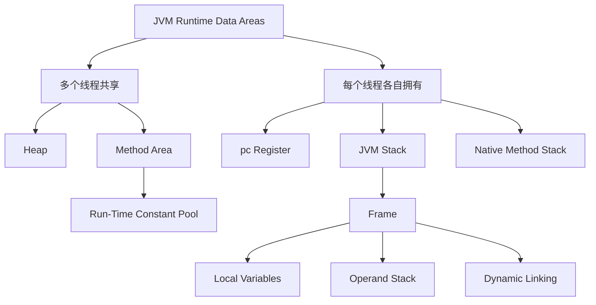
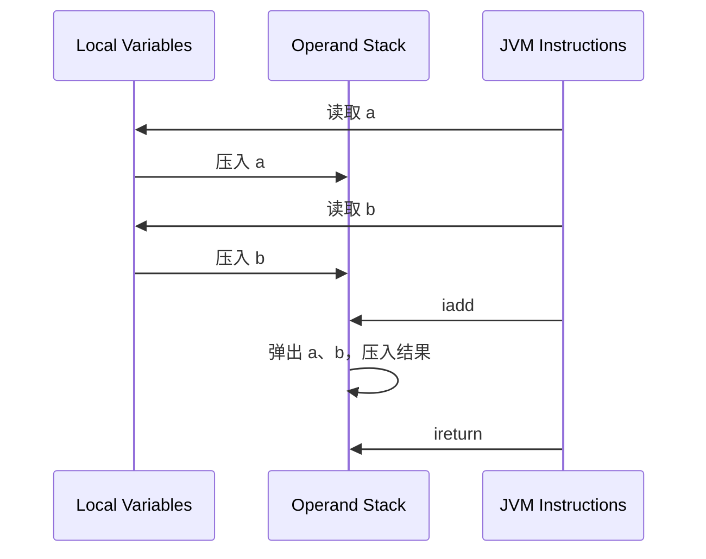
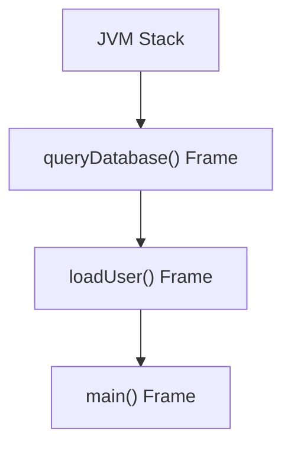
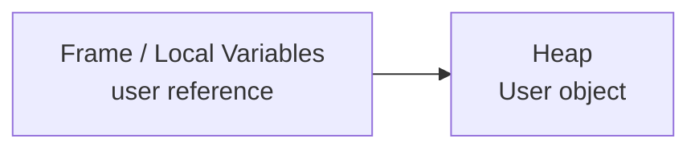
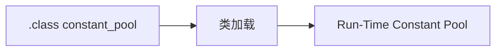

以前提到 JVM 内存，我脑子里通常只有两个词：

> 栈和堆。

继续往下学之后才发现，这种理解能应付最基础的问题，但不足以解释一个方法到底怎么运行，也很容易把“栈”“栈帧”“局部变量”和“对象”混成一团。

真正有用的切入点不是背区域名称，而是从一次方法调用开始。

## 先看 JVM 的运行时数据区

按照 JVM 规范，可以先建立下面这张地图：



这张图里，我认为最值得先掌握的是：

```text
Thread
↓
JVM Stack
↓
Frame
↓
Local Variables + Operand Stack
```

因为这条链和日常写的方法调用直接相关。

## 方法调用时真正发生了什么

假设有一个最简单的方法：

```java
int add(int a, int b) {
    return a + b;
}
```

当这个方法被调用时，JVM 会为这次调用创建一个 Frame，也就是栈帧。

可以把 Frame 先理解成：

> 一次方法调用自己的运行工作台。

里面至少有两个非常重要的区域。

### Local Variables

局部变量表用于保存方法执行期间需要访问的数据，例如：

- 方法参数
- 局部变量
- 对象引用

对于 `add(int a, int b)`，`a` 和 `b` 就会出现在局部变量表对应的位置。

### Operand Stack

操作数栈可以理解成字节码指令计算时使用的临时工作区。

一个加法过程可以抽象成：



所以 JVM bytecode 的很多指令，本质上就是不断在：

```text
局部变量表
↕
操作数栈
```

之间搬运和计算数据。

## JVM Stack 和 Frame 不是一回事

这是我学习时很容易混的地方。

```text
一个线程
→ 有自己的 JVM Stack

一次方法调用
→ 对应一个 Frame

多个嵌套方法调用
→ Stack 中存在多个 Frame
```

例如：

```java
main()
  -> loadUser()
      -> queryDatabase()
```

可以概念化成：



当前正在执行的方法通常对应栈顶 Frame。

方法正常返回后，这个 Frame 也随之结束。

## Heap 放的是什么

JVM 规范中的 Heap 是所有类实例和数组分配存储的运行时区域。

所以：

```java
User user = new User();
```

不要理解成：

> user 在堆里。

更准确的说法是：

- `new User()` 创建出的对象实例位于 Heap
- 局部变量 `user` 是一个 reference
- 这个 reference 如果是方法局部变量，会存在当前 Frame 的 Local Variables 中

也就是：



引用和对象本身是两个概念。

## Method Area 和 Run-Time Constant Pool

Method Area 用于保存 JVM 需要的类级结构信息。

规范会把它描述为保存每个 class 的结构，例如：

- Runtime Constant Pool
- 字段和方法数据
- 方法和构造方法的代码等

这里还有一个特别容易混淆的概念：

```text
ClassFile constant_pool
!=
Run-Time Constant Pool
```

`.class` 文件中的 `constant_pool` 是静态文件结构的一部分。

类被加载进入 JVM 之后，JVM 会建立对应的运行时常量池表示。

所以可以理解为：



它们有关联，但不是同一个东西。

## StackOverflowError 为什么和递归有关

如果方法不断调用自己：

```java
void loop() {
    loop();
}
```

调用链会不断产生新的 Frame。

```text
loop Frame
loop Frame
loop Frame
loop Frame
...
```

当线程需要的 Stack 空间超过 JVM 能允许的范围时，就可能抛出 `StackOverflowError`。

所以它的核心不是“递归这个语法有问题”，而是：

> 方法调用层级不断增加，Frame 持续压栈。

递归只是最常见的触发方式之一。

## OutOfMemoryError 不等于“堆满了”

另一个需要修正的粗糙说法是：

> OOM 就是 Heap 满了。

Heap 无法继续分配对象当然是最常见的 OOM 场景之一。

但 JVM 规范允许多个运行时区域在资源不足时抛出 `OutOfMemoryError`。

因此面试时更准确的说法应该是：

> OOM 表示 JVM 无法获得所需内存资源，Heap 分配失败只是其中最常见的一类。

## 这套知识和 Android 有什么关系

Android 使用 ART，不是 HotSpot JVM，所以不能把 JVM 内存实现细节直接复制到 ART。

但这套 JVM 基础仍然非常有价值。

因为它帮助建立几个底层概念：

- 方法调用和栈帧
- 局部变量与对象引用
- 对象生命周期
- 字节码如何处理数据
- StackOverflow 与 OOM 的差异
- 为什么内存问题不能只盯着一个“堆”字

以后再学习 Android 内存、GC、线程、ANR 或性能分析时，这些概念会重新出现。

## 我现在的最小心智模型

```text
线程
└── JVM Stack
    └── Frame
        ├── Local Variables
        └── Operand Stack

JVM
├── Heap：对象和数组
└── Method Area
    └── Run-Time Constant Pool
```

当我能把一个具体方法和这张图连起来时，“JVM 运行时数据区”才真正从面试题变成了可理解的运行模型。

## 参考资料

- [Java Virtual Machine Specification: Run-Time Data Areas](https://docs.oracle.com/en/java/javase/27/docs/specs/jvms/jvms-2.html#jvms-2.5)
- [Java Virtual Machine Specification: Frames](https://docs.oracle.com/en/java/javase/27/docs/specs/jvms/jvms-2.html#jvms-2.6)
