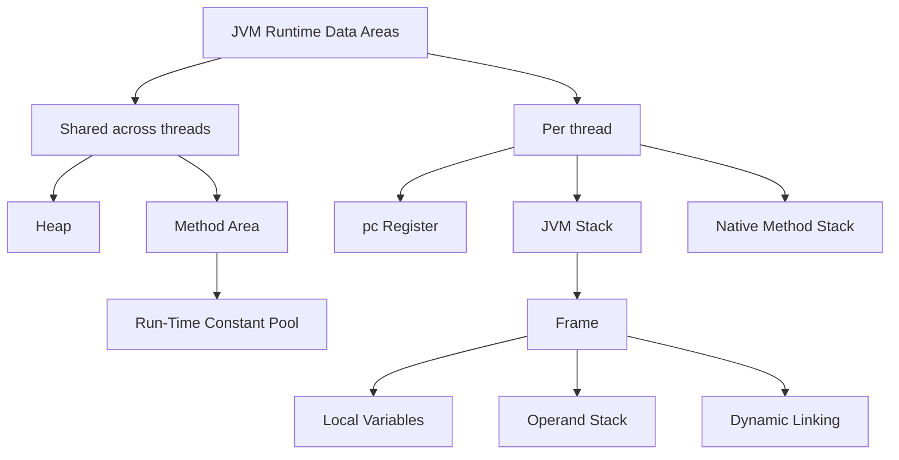
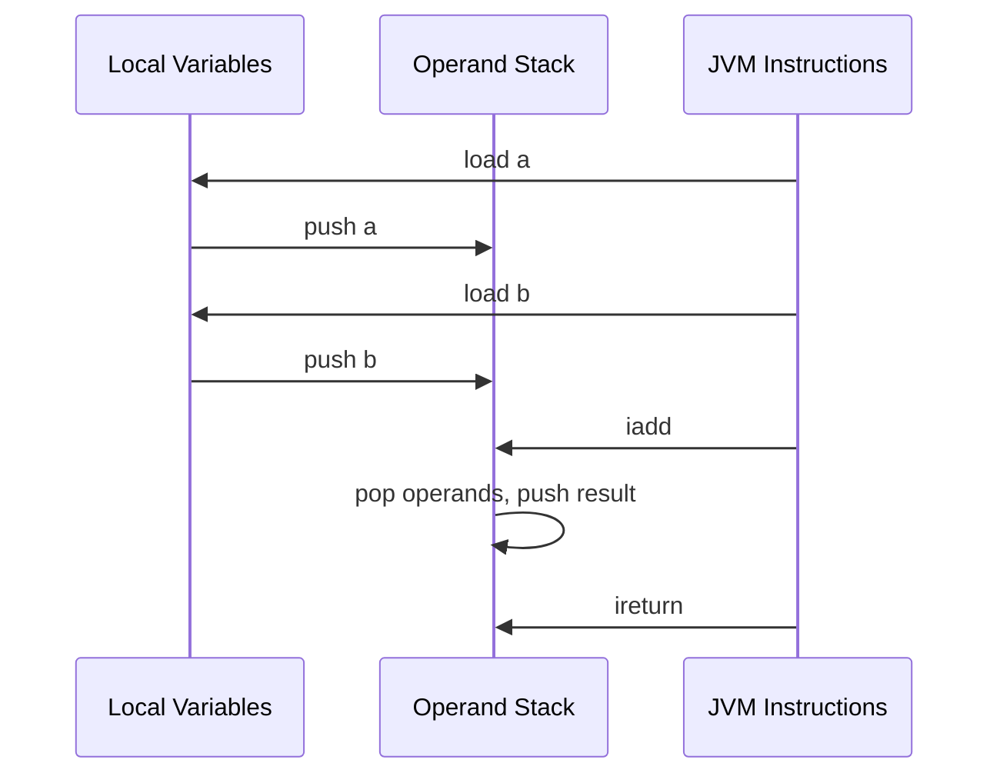
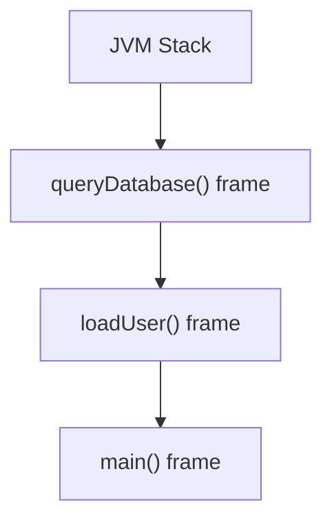
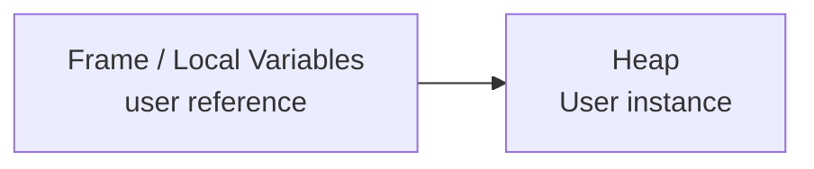
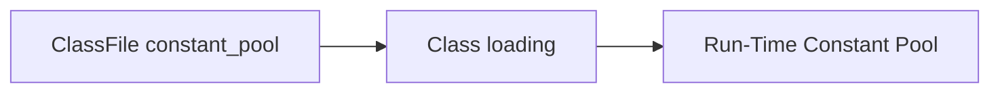

For a long time, my JVM memory model was basically two words: stack and heap.

That model is too small once you start asking how a method actually executes.

The concept that finally connected everything for me was the **frame**.

## The useful runtime map

The JVM specification defines several run-time data areas.



The part I use most often is:

```text
thread -> JVM stack -> frame -> local variables + operand stack
```

## One invocation, one frame

Consider:

```java
int add(int a, int b) {
    return a + b;
}
```

A frame is created for a particular invocation of this method.

I think of it as the execution workspace for that call.

The **local variable array** holds parameters, local values, and references that the bytecode needs.

The **operand stack** is the temporary calculation area used by JVM instructions.

Conceptually, an integer addition looks like this:



This explains why JVM bytecode often looks stack-oriented: instructions move values between local-variable slots and the operand stack.

## A stack contains frames

A JVM stack belongs to a thread. A frame belongs to one method invocation.

If:

```text
main()
  -> loadUser()
      -> queryDatabase()
```

then the same thread can have multiple frames on its JVM stack.



When a method returns, its frame completes and the caller becomes active again.

## References are not objects

For:

```java
User user = new User();
```

the object instance is allocated from the heap.

The local variable `user` is a reference. If it is a local variable, that reference is stored in the current frame's local-variable array.



This distinction is small but important. Many confusing explanations of Java memory come from treating the reference and the referenced object as the same thing.

## Method Area and the Run-Time Constant Pool

The method area stores class-level structures required by the JVM, including the run-time constant pool and method-related data.

The class-file constant pool and the run-time constant pool are related, but they are not identical objects.



The first one is part of a binary class file. The second is the runtime representation associated with a loaded class or interface.

## StackOverflowError and OutOfMemoryError

Deep or infinite method invocation creates more frames.

If a thread needs more JVM-stack space than the implementation permits, `StackOverflowError` can be thrown.

Recursive code is a common cause because it naturally keeps adding calls.

`OutOfMemoryError` is broader. Heap allocation failure is a common case, but OOM should not be defined as simply "the heap is full." Different runtime areas can fail to obtain the memory they require.

## Why an Android engineer should care

Android runs ART rather than HotSpot, so JVM implementation details should not be copied directly onto Android.

The concepts are still useful foundations for understanding:

- call stacks and stack traces
- object references
- allocation
- bytecode execution
- stack overflow
- memory pressure
- later GC and performance topics

Once a concrete method call can be mapped to a frame, local variables, an operand stack, and heap objects, JVM memory stops being a diagram to memorize and starts becoming an execution model.

## References

- [JVMS: Run-Time Data Areas](https://docs.oracle.com/en/java/javase/27/docs/specs/jvms/jvms-2.html#jvms-2.5)
- [JVMS: Frames](https://docs.oracle.com/en/java/javase/27/docs/specs/jvms/jvms-2.html#jvms-2.6)
