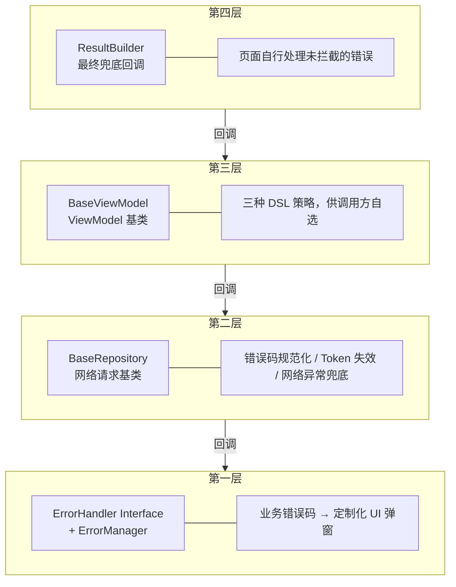
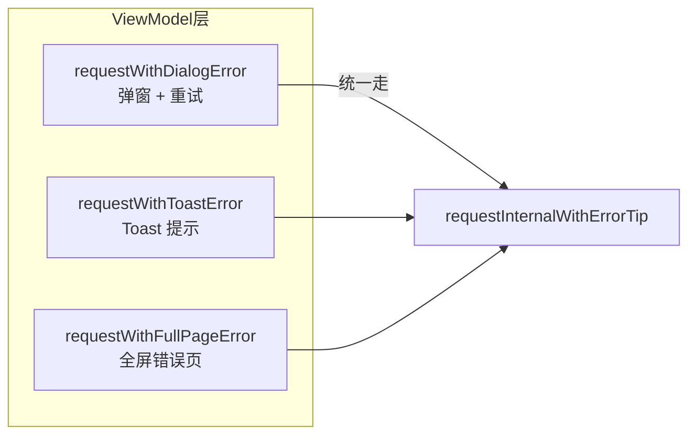
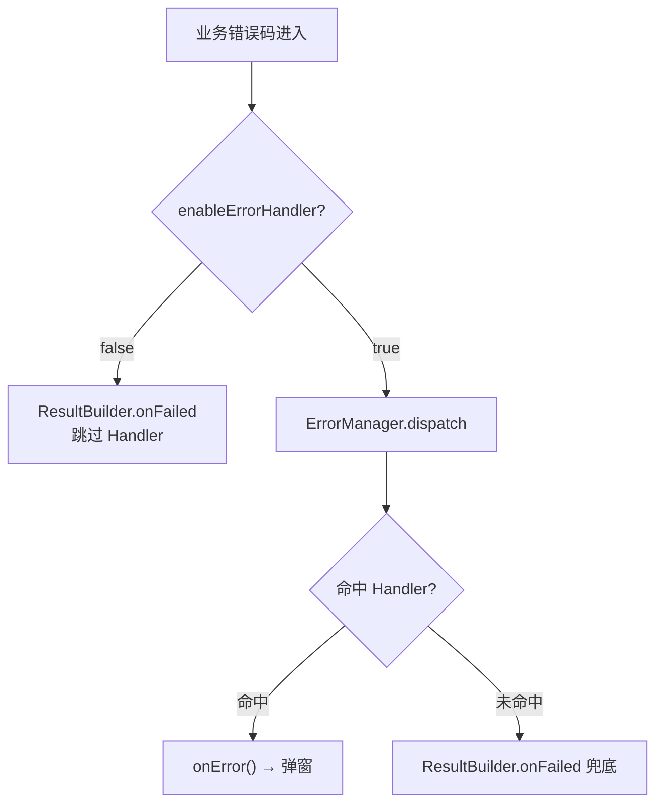
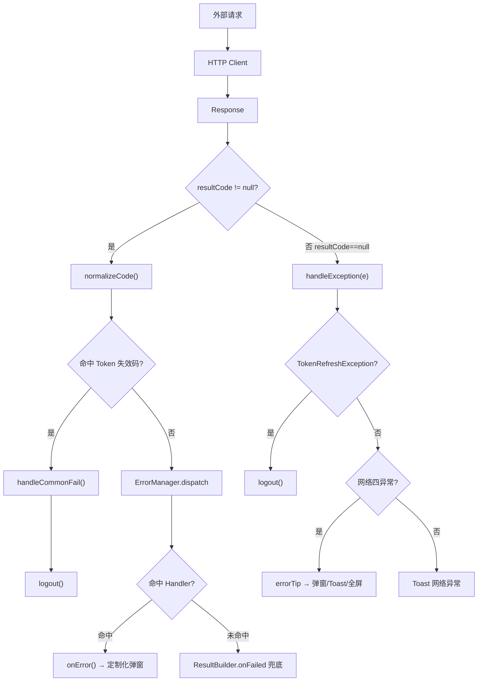

## 背景

支付类 App 是所有消费级应用中对错误处理要求最严苛的品类之一：

- **交易失败必须给用户清晰的反馈**，含糊的"网络异常"不够用
- **不同业务场景需要不同的错误展示形式**，余额不足弹对话框、OTP 失败弹底部提示、敏感操作弹带电话入口的告警弹窗
- **Token 失效不能出现多次登出**，多个并发请求同时触发时只能执行一次 logout
- **错误码体系分散在多个模块**，不能集中硬编码，否则改一处牵动全身

本文基于生产环境真实代码，梳理一个四层协作的错误处理架构。所有具体类名已做泛化处理，仅保留架构模式和技术实质。

---

## 一、整体架构



**每层职责单一，层级之间通过回调串联，没有循环依赖。**

---

## 二、第一层：业务错误码分发

### 2.1 核心接口

```kotlin
interface ErrorHandler {
    fun accept(code: String): Boolean
    fun onError(errorCode: String, errorMsg: String)
}
```

- `accept` 返回 `true` → 拦截此错误码，向下传递终止
- `onError` 执行自定义错误展示逻辑

### 2.2 分发机制

```kotlin
object ErrorManager {
    private val handlers = arrayListOf<ErrorHandler>()

    fun register(handler: ErrorHandler) {
        if (handlers.contains(handler)) return
        handlers.add(handler)
    }

    fun dispatch(code: String, msg: String): Boolean {
        handlers.forEach {
            if (it.accept(code)) {
                MainScope().launch(Dispatchers.Main) { it.onError(code, msg) }
                return true
            }
        }
        return false
    }
}
```

**关键设计点：**

| 设计点 | 说明 |
|--------|------|
| **链式拦截** | 按注册顺序遍历，**第一个命中即停止**，不级联 |
| **主线程安全** | UI 操作强制切 `Dispatchers.Main` |
| **Boolean 返回值** | 告知外层是否被拦截，决定是否继续走 `ResultBuilder` |

### 2.3 业务 Handler 示例

```kotlin
class BusinessErrorHandler : ErrorHandler {

    private val physicalCardCodes = listOf("PHYSICAL_01", "PHYSICAL_02", "PHYSICAL_03", "PHYSICAL_04")
    private val p2pTransferCodes = listOf("P2P_01", "P2P_02", "P2P_03", "P2P_04", "P2P_05")
    private val shareCardCodes = listOf("SHARE_01", "SHARE_02")

    override fun accept(code: String): Boolean {
        return code in physicalCardCodes || code in p2pTransferCodes || code in shareCardCodes
    }

    override fun onError(errorCode: String, errorMsg: String) {
        when (errorCode) {
            in physicalCardCodes -> showErrorDialogWithCallCenter(...)
            in p2pTransferCodes -> showBottomSheetError(...)
            in shareCardCodes -> showSimpleTipDialog(...)
        }
    }
}
```

**三种弹窗类型对比：**

| 弹窗类型 | 典型场景 | 特点 |
|---------|-----------|------|
| 带电话入口的错误弹窗 | 物理卡操作失败 | 图标 + 错误码 + **拨打电话入口**，适合需要客服介入的场景 |
| 底部轻量弹窗 | P2P 转账失败 | 底部弹出，轻量化，适合高频交易场景 |
| 简洁提示弹窗 | 分享卡重复操作 | 一键关闭，适合重复操作拦截 |

> 💡 **新增业务错误码只需三步：**
> 1. 在 Handler 的错误码列表中加入新码
> 2. 在 `when` 分支添加弹窗逻辑
> 3. 在 Application 中注册 Handler（如果尚未注册）
>
> **无需修改 Repository / ViewModel / 页面代码** — 符合开闭原则。

---

## 三、第二层：BaseRepository（底层拦截）

`BaseRepository` 是所有网络请求的基类，负责**协议层和业务层的统一处理**，所有业务模块的 Repository 都继承它。

### 3.1 错误码规范化

接口返回的错误码格式为 `前缀-具体码`，如 `PREFIX-04200`，基类负责截取尾部数字：

```kotlin
override fun normalizeCode(result: BaseResult) {
    result.resultCode = result.resultCode.split("-").let {
        if (it.size > 1) it.last() else it[0]
    }
}
```

> 📌 所有上游接口的错误码前缀不统一，统一截取尾部数字后，各业务 Handler 只需按纯数字匹配即可。

### 3.2 Token 失效兜底

```kotlin
override fun getCommonFailCodes(): List<String> {
    return listOf(TOKEN_NULL, TOKEN_INVALID, TOKEN_INVALID_2, TOKEN_INVALID_3)
}

override fun handleCommonFail(result: BaseResult) {
    when (result.resultCode) {
        TOKEN_INVALID, TOKEN_NULL, TOKEN_INVALID_2, TOKEN_INVALID_3 -> {
            synchronized(lock) {
                authService.logout(sessionOverTime = true)
            }
        }
    }
}
```

> ⚠️ **`synchronized(lock)` 是关键**：多个并发请求同时收到 Token 失效响应时，只有一个线程能进入同步块并执行登出逻辑，避免重复调用 `logout()`。

### 3.3 网络层异常处理

```kotlin
override fun handleException(e: Throwable) {
    if (e.message != "Canceled") {
        when (e) {
            is TokenRefreshException -> authService.logout(sessionOverTime = true)
            else -> { /* 透传到 ViewModel 层 */ }
        }
    }
}
```

| 异常类型 | 处理方式 |
|---------|---------|
| `TokenRefreshException` | 同步块内登出，清 session 跳转登录页 |
| `Connect / Socket / SSL / UnknownHost` | 透传到 ViewModel 层，由 DSL 策略决定展示形式 |
| `Canceled` | 静默丢弃，不走任何 Handler |

---

## 四、第三层：BaseViewModel（三策略 DSL）

ViewModel 基类暴露三个高阶函数，**调用方自行选择**错误展示策略：



### 4.1 三种策略

```kotlin
fun <T> requestWithDialogError(
    request: suspend () -> Response<T>,
    enableErrorHandler: Boolean = true,
    retryCallback: (() -> Unit)? = null,
    result: ResultBuilder<T>.() -> Unit
)

fun <T> requestWithToastError(
    request: suspend () -> Response<T>,
    result: ResultBuilder<T>.() -> Unit
)

fun <T> requestWithFullPageError(
    request: suspend () -> Response<T>,
    result: ResultBuilder<T>.() -> Unit
)
```

### 4.2 统一分发逻辑

三个策略内部统一走 `requestInternalWithErrorTip`，`errorTip` 回调由各策略注入（Dialog / Toast / FullPage）。

### 4.3 决策流程



### 4.4 网络异常判定

```kotlin
fun isNetworkError(error: Throwable): Boolean {
    return error is ConnectException
        || error is SocketTimeoutException
        || error is SSLException
        || error is UnknownHostException
}
```

只有这四类网络异常才触发弹窗/Toast/全屏，业务自定义异常不会触发。

### 4.5 并发请求策略

```kotlin
concurrentRequests(*requests, isAsync = true, showLoading = true) {
    // Dialog 策略
    ActivityManager.top()?.let { NetworkErrorDialog(it, retryCallback).show() }
    // Toast 策略
    ToastUtil.show(getString(R.string.network_error))
    // FullPage 策略
    errorState.postValue(it)
}
```

---

## 五、第四层：ResultBuilder DSL（最终兜底）

`ResultBuilder` 是最底层的回调，由调用方自行处理未命中的错误：

```kotlin
viewModel.requestWithDialogError(request = { api.queryBalance() }) {
    onSuccess { balance -> updateUI(balance) }
    onFailed { code, msg -> showCustomDialog(code, msg) }
    onError { error -> logError(error) }
}
```

**三个回调的触发条件：**

| 回调 | 触发条件 |
|------|---------|
| `onSuccess` | `resultCode == 0` 或 `resultCode == "0000"` |
| `onFailed` | `resultCode != 0` 且**未命中**任何 `ErrorHandler` |
| `onError` | 网络异常 / 请求取消 / 解析异常 / 运行时异常 |

---

## 六、完整数据流



---

## 七、设计亮点

### ✨

1. **分层职责清晰**
   - 业务错误码 ↔ 网络异常 ↔ UI 展示三级分离，各层互不侵入
   - 新增一种错误展示形式只需注入新策略，无需修改 Repository

2. **Handler 链式拦截符合开闭原则**
   - 新增业务错误处理只需注册新 `ErrorHandler`，无需修改已有代码
   - 各业务线可以独立管理自己的错误码，互不影响

3. **DSL 高阶函数减少样板代码**
   - 三策略由调用方自选，ViewModel 基类保持简洁
   - 每个页面无需重复写 try-catch / loading 状态管理

4. **Token 失效 `synchronized` 保护**
   - 多个并发请求同时触发 Token 过期时，`synchronized(lock)` 保证只执行一次登出逻辑
   - 避免瞬时大量 `logout()` 调用导致 UI 抖动

---

*本文基于真实生产代码整理，类名及错误码已做泛化处理，仅保留技术架构实质。*
