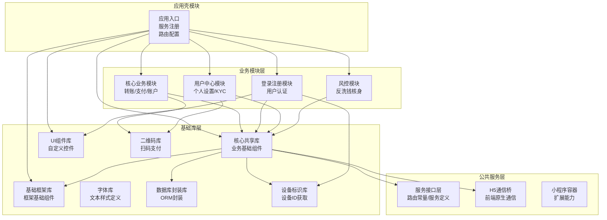
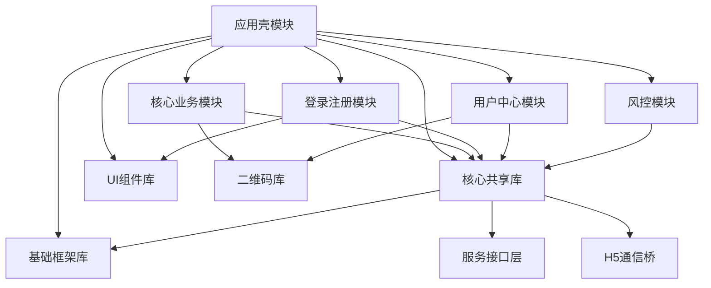
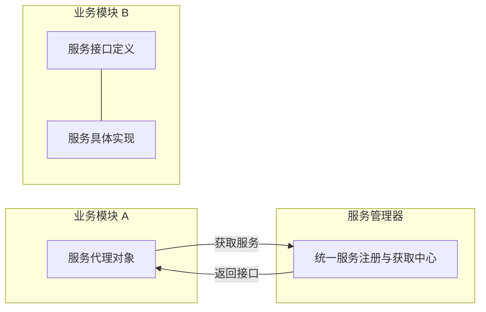
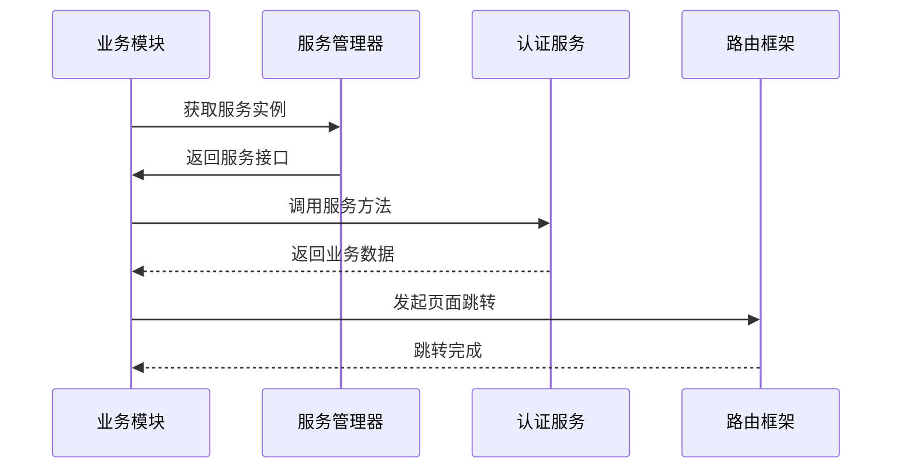
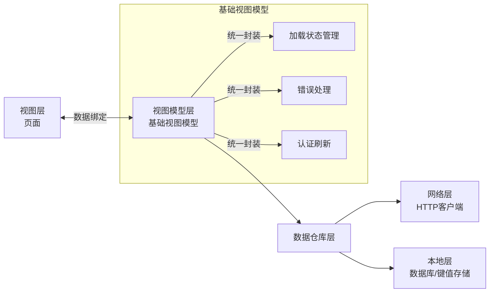
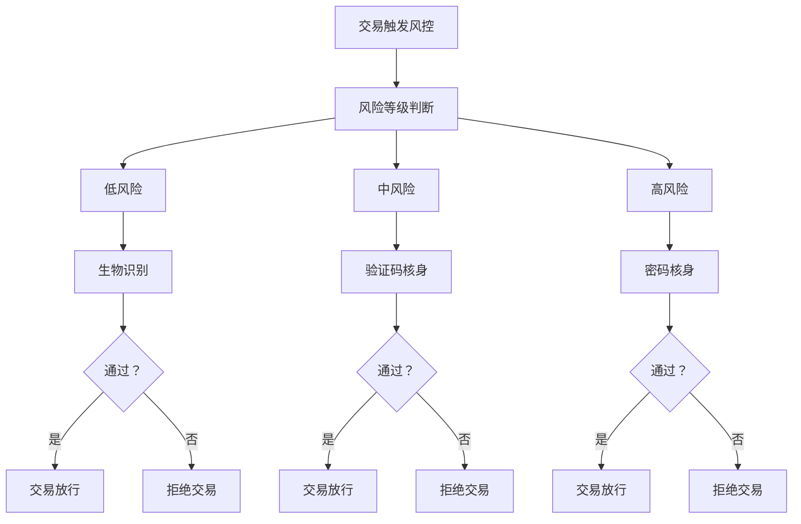
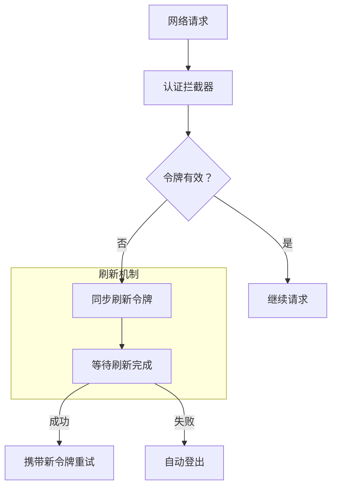
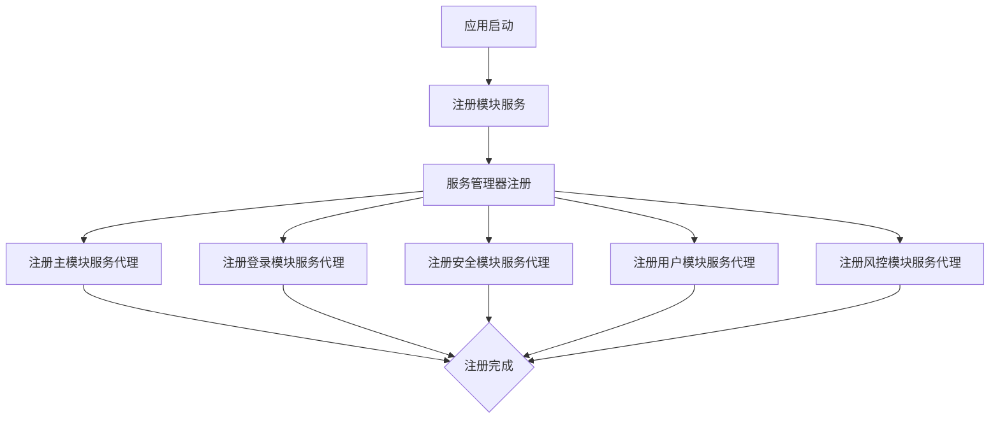
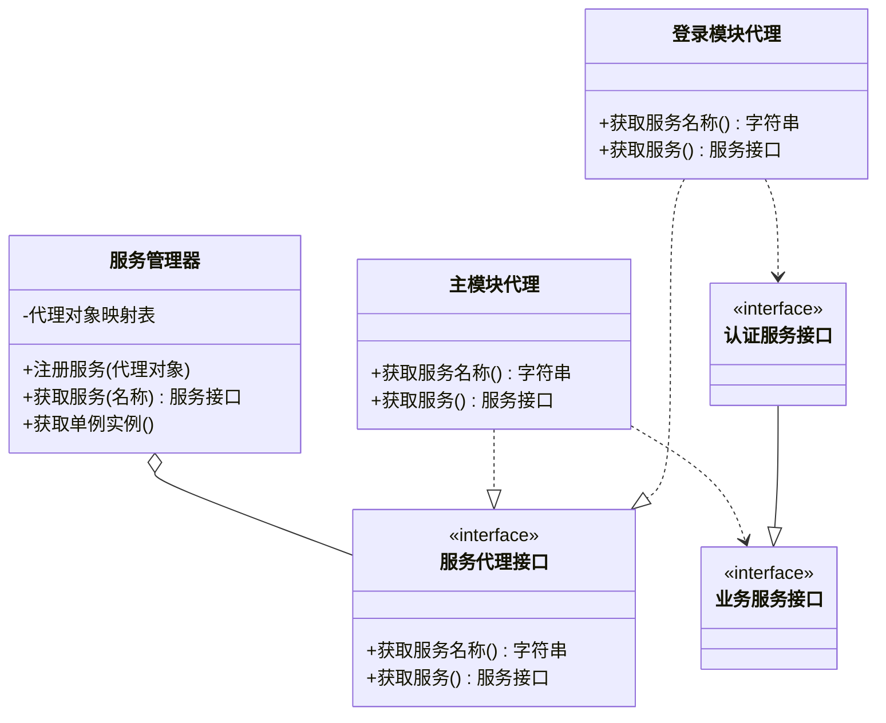

## 背景

移动支付应用是消费级市场中最为复杂的应用类型之一。它们需要极高的安全性、高可用性、严格的交易完整性，以及跨市场扩展能力。在这篇文章中，我来详细拆解一个实际生产环境的 Android 支付应用架构——这也是我为墨西哥市场构建并上线的同一套系统。

这不是一个演示项目。它是 **15 个模块、约 13 万行代码**，服务于监管环境下的真实用户。

---

## 核心挑战

大多数 Android 应用最初都是单模块架构。随着规模增长，三类问题随之出现：

1. **耦合** — 每个功能都依赖其他所有功能，改一处可能破坏三处。
2. **编译时间** — 单体应用每次改动都需要全量编译。
3. **团队协作摩擦** — 多个团队在同一模块中互相踩踏代码。

支付应用还增加了第四个挑战：**安全性和合规不可妥协**。每一个架构决策都必须考虑监管要求、反欺诈措施和财务审计追踪。

---

## 架构总览

**核心设计原则：** 壳模块不包含任何业务逻辑，只负责协调。

---

## 模块依赖层级

---

## 多模块服务代理模式

最重要的架构决策是采用 **服务代理模式**——灵感来源于 Android 自身的系统服务设计。

各业务模块之间不直接互相调用，而是通过 **Service Manager（服务管理器）** 统一注册和获取服务代理对象。

**为什么这样做：**

| 特性 | 收益 |
|------|------|
| **低耦合** | 模块间仅通过接口通信 |
| **高度可替换** | 可在运行时替换实现（类插件化行为）|
| **可测试性** | 可用 Mock 服务替代真实服务进行单元测试 |
| **一致性** | 所有模块访问同一套统一 API |

每个代理对象存在于其所属模块内部，模块仅向其他模块暴露必要的内容。

---

## 典型调用时序

---

## 统一 MVVM 架构

每个业务模块都遵循相同的 MVVM 模式，但关键增强在于：**基础 ViewModel 集中处理横切关注点**。

每个模块的 ViewModel 继承自提供基础能力的基础类，而不是在每个 ViewModel 中重复编写相同的错误处理逻辑。

与常规写法相比，这套方案将模块级 ViewModel 代码量减少了约 **60%**。

---

## 安全架构

支付应用靠安全性生存或死亡。以下是安全是如何融入架构的：

### 第一层：传输层安全

自定义 `SSLSocketFactory` + 证书锁定（Certificate Pinning），仅在生产构建中启用。开发构建支持可配置的信任设置以满足内部测试需求。

### 第二层：应用层安全

| 安全层 | 实现方式 |
|--------|----------|
| 生物识别 | 指纹、面容、虹膜三种方式，按交易金额动态切换 |
| Root 检测 | Release 构建在 Root 设备上拒绝运行 |
| 令牌管理 | 同步刷新机制，刷新失败自动登出 |
| 崩溃上报 | Firebase Crashlytics（生产环境可开关）|

### 第三层：交易安全（AML / KYC）

AML 模块与其他业务模块**完全独立运行**。这不是偶然设计——金融监管要求反欺诈模块不能被其他模块的业务逻辑绕过。

---

## 令牌自动刷新机制

**设计要点：**
- HTTP 拦截器自动检测令牌有效期
- 同步刷新机制，避免并发问题
- 刷新失败自动登出，保证安全性

---

## 服务注册流程

---

## 服务代理类图

---

## 构建配置矩阵

一个节省大量时间的关键工程细节：**6 套构建环境**，各自独立配置：

| 环境 | 用途 | HTTP 日志 | SSL | 可调试 |
|------|------|----------|-----|--------|
| `dev` | 本地开发 | ✅ | ❌ | ✅ |
| `deb` | Debug 构建 | ✅ | ❌ | ✅ |
| `sit` | 集成测试 | ✅ | ❌ | ✅ |
| `uat` | QA 验收 | ✅ | ❌ | ✅ |
| `hfx` | 热修复 | ❌ | ❌ | ✅ |
| `pro` | 生产发布 | ❌ | ✅ | ❌ |

每套环境对应独立的 API 端点、签名配置和功能开关集合。CI/CD 流水线自动定向到对应环境。

---

## 第三方服务集成

该应用集成了真实的外部服务：

- **HERE SDK** — 商户定位地图服务
- **MetaMap** — KYC 身份认证（身份证 + 自拍）
- **Firebase** — 崩溃报告、性能监控、推送通知
- **滴滴平台** — 内部性能分析和网络抓包

这些集成都通过共享库中的封装类进行隔离。如果某个第三方 SDK 需要替换，只需改动封装类，应用其余部分不受影响。

---

## 核心要点

如果你正在构建或参与一个大型 Android 应用：

1. **先设计模块边界** — 不是功能划分，不是层级划分。模块边界是后期最难改动的设计决策。
2. **服务代理模式解决模块耦合** — 不是唯一方案，但已在生产支付应用中验证有效。
3. **统一错误处理放在一个地方** — 不要让错误处理逻辑分散在各个 ViewModel 中，集中到基础类里。
4. **安全是架构问题，不是功能特性** — 在写第一行业务逻辑之前，先设计好安全模型。
5. **CI/CD + 多环境构建不是可选项** — 15 个模块 + 6 套环境，手动构建相当于一个人全职在做。

---

*本文基于我主导墨西哥市场某生产支付应用 Android 架构的经验撰写。架构描述已做脱敏处理，保留技术实质。*