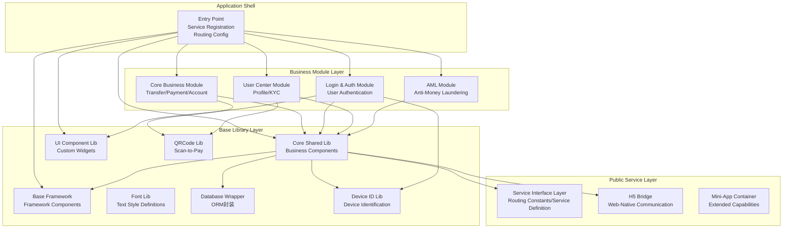
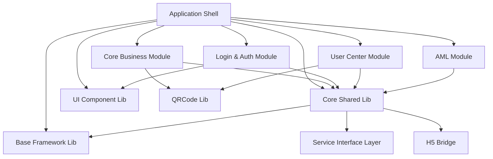
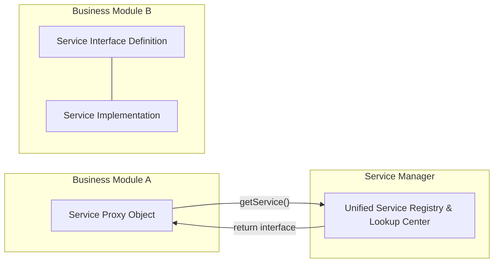
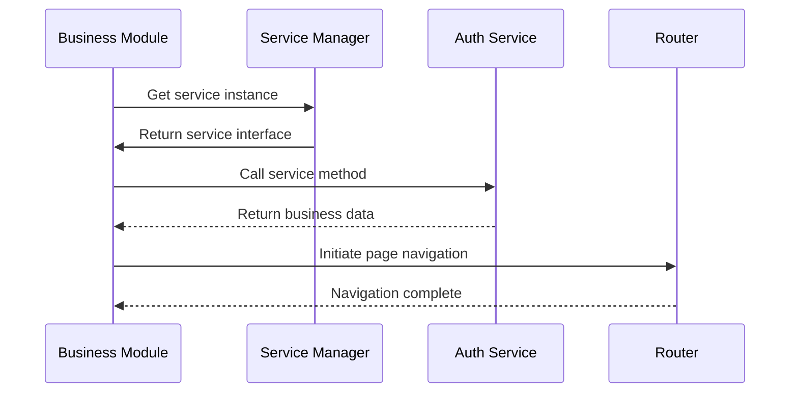
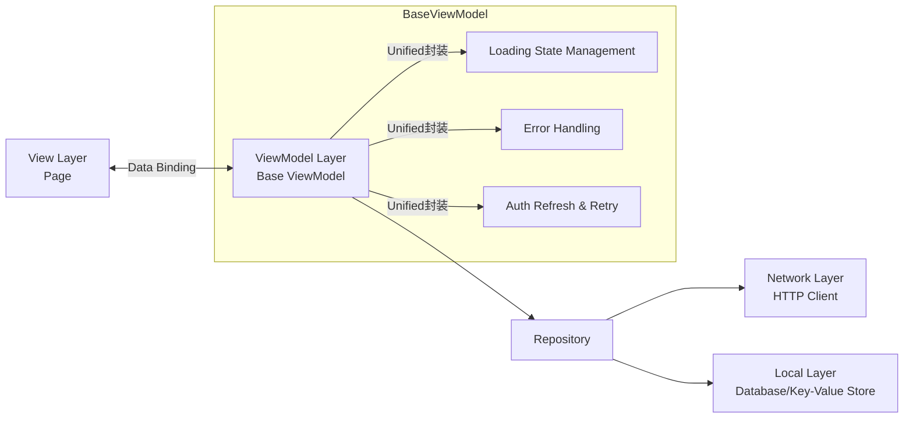
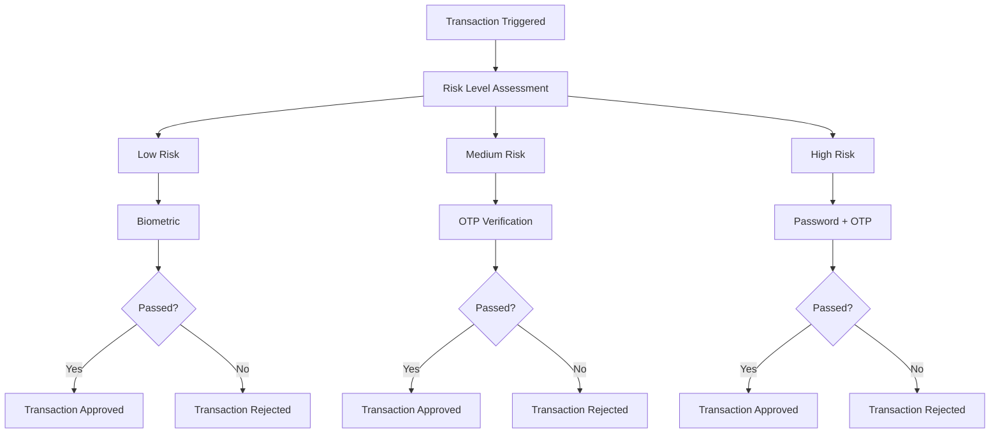
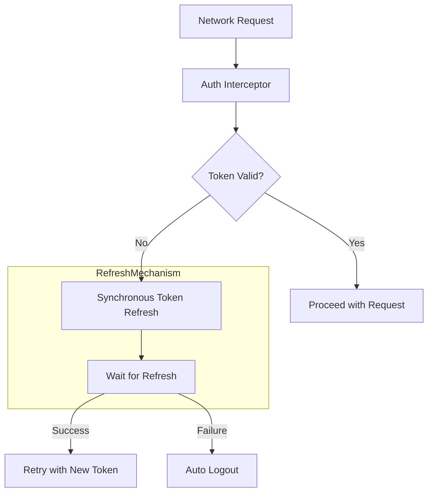
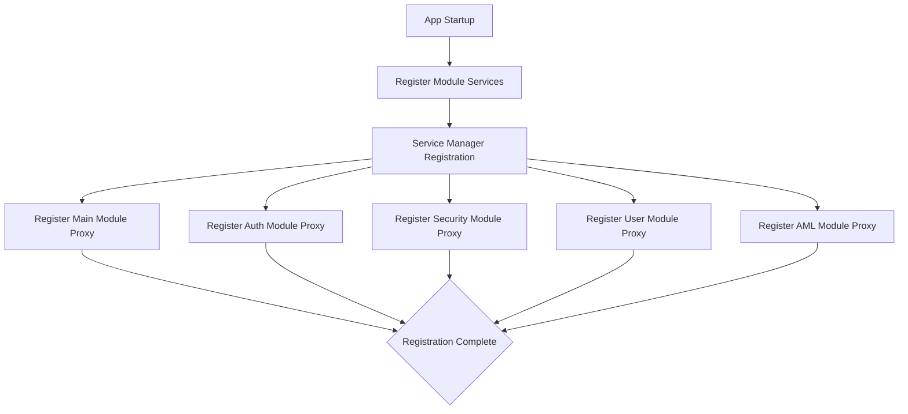
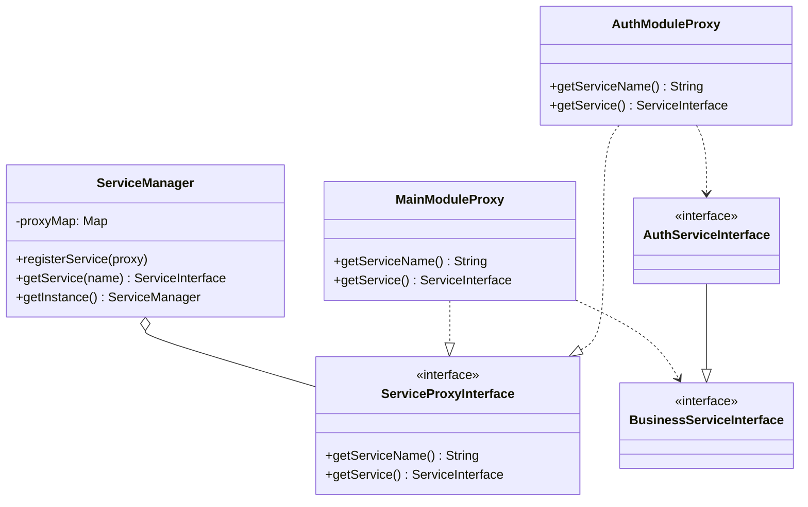

## Background

Mobile payment apps are among the most complex consumer applications in the market. They require rock-solid security, high availability, strict transaction integrity, and the ability to scale across markets. In this post, I'll walk through the architecture of a production-grade Android payment application — the same system I built and shipped to the Mexican market.

This isn't a demo project. It's **15 modules, ~130K lines of code**, serving real users in a regulated financial environment.

---

## The Core Challenge

Most Android apps start as a single module. As they grow, three problems emerge:

1. **Coupling** — Every feature depends on every other feature. Change one thing, break three others.
2. **Build times** — A single monolithic app means recompiling everything for every change.
3. **Team friction** — Multiple teams stepping on each other's code in the same module.

Payment apps add a fourth challenge: **security and compliance** can't be optional. Every architectural decision must account for regulatory requirements, fraud prevention, and financial audit trails.

---

## Architecture Overview

**Key Design Principle:** The shell module knows nothing about business logic. It only coordinates; it doesn't contain any.

---

## Module Dependency Hierarchy

---

## Multi-Module Service Proxy Pattern

The most important architectural decision was adopting the **Service Proxy Pattern** — inspired by Android's own system services design.

Instead of modules calling each other directly, every business module exposes a **service proxy** registered with a central **Service Manager**.

**Why this works:**

| Property | Benefit |
|----------|---------|
| **Loose coupling** | Modules communicate only through interfaces |
| **Replaceability** | Swap implementations at runtime (plugin-like behavior) |
| **Testability** | Mock services can replace real ones in unit tests |
| **Consistency** | All module access goes through the same unified API |

Each proxy object lives in the module that owns it, and the module exposes only what other modules need — nothing more.

---

## Typical Call Sequence

---

## Unified MVVM Architecture

Every business module follows the same MVVM pattern, but with a critical enhancement: **centralized base ViewModels** that handle cross-cutting concerns automatically.

Instead of writing the same error-handling boilerplate in every ViewModel, every module's ViewModel inherits from a base that provides:

- Standardized loading/error/success state transitions
- Automatic token refresh with synchronized retry
- Centralized exception handling

This reduced module-specific ViewModel code by roughly **60%** compared to a conventional approach.

---

## Security Architecture

A payment app lives or dies by its security posture. Here's how security is woven into the architecture:

### Layer 1: Transport Security

Custom `SSLSocketFactory` + certificate pinning for all production builds. Development builds use configurable trust settings to support internal testing.

### Layer 2: Application Security

| Security Layer | Implementation |
|----------------|----------------|
| Biometric auth | Fingerprint, Face ID, Iris — configurable per transaction value |
| Root detection | Release builds refuse to run on rooted devices |
| Token management | Auto-refresh with synchronized retry; auto-logout on refresh failure |
| Crash reporting | Firebase Crashlytics (production toggle) |

### Layer 3: Transaction Security (AML / KYC)

The AML module operates **fully independently** from other business modules. This isn't an accident — financial regulations require that fraud prevention cannot be bypassed by business logic in other modules.

---

## Token Auto-Refresh Mechanism

**Design Highlights:**
- HTTP interceptor automatically detects token expiration
- Synchronized refresh mechanism prevents race conditions
- Refresh failure triggers auto-logout for security

---

## Build Configuration Matrix

One practical detail that saves enormous time: **6 build environments** with independent configurations:

| Environment | Purpose | HTTP Logging | SSL | Debuggable |
|-------------|---------|-------------|-----|------------|
| `dev` | Local development | ✅ | ❌ | ✅ |
| `deb` | Debug builds | ✅ | ❌ | ✅ |
| `sit` | Integration testing | ✅ | ❌ | ✅ |
| `uat` | QA acceptance | ✅ | ❌ | ✅ |
| `hfx` | Hotfix | ❌ | ❌ | ✅ |
| `pro` | Production release | ❌ | ✅ | ❌ |

Each environment maps to a distinct API endpoint, signing configuration, and feature flag set. CI/CD pipelines target specific environments automatically.

---

## Service Registration Flow

---

## Service Proxy Class Diagram

---

## Third-Party Integrations

This app integrates with real external services:

- **HERE SDK** — Map services for merchant discovery
- **MetaMap** — KYC identity verification (government ID + selfie)
- **Firebase** — Crash reporting, performance monitoring, push notifications
- **DiDi Platform** — In-house performance profiling and network tracing

These integrations are isolated behind wrapper classes in the Common Library. If a third-party SDK needs to be replaced, only the wrapper changes — the rest of the app is unaffected.

---

## Key Takeaways

If you're building or contributing to a large-scale Android app:

1. **Design for module boundaries first** — Not features, not layers. Module boundaries are the hardest thing to change later.
2. **Service proxy pattern solves module coupling** — It's not the only way, but it's battle-tested in a production payment app.
3. **Unified error handling in one place** — Don't let error handling logic scatter across ViewModels. Centralize it in a base class.
4. **Security is an architectural concern, not a feature** — Design your security model before writing the first line of business logic.
5. **CI/CD + multi-environment builds are not optional** — With 15 modules and 6 environments, manual builds would be a full-time job.

---

*This post is based on my experience leading the Android architecture for a production payment application serving the Mexican market. The architecture described has been adapted to remove proprietary naming while preserving the technical substance.*